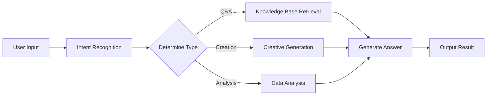
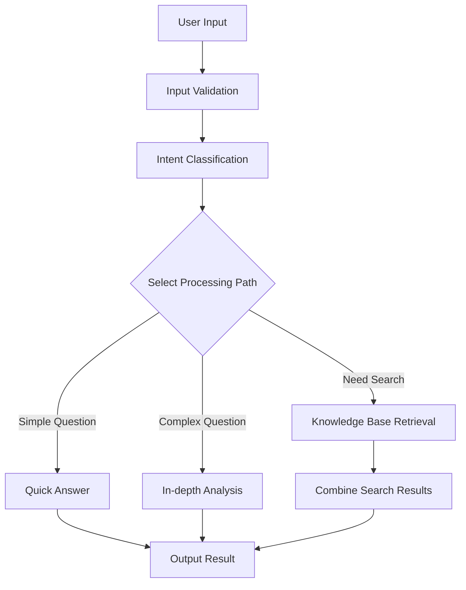

> ## Documentation Index
> Fetch the complete documentation index at: https://docs.apiyi.com/llms.txt
> Use this file to discover all available pages before exploring further.

# Dify

> Visual AI application development platform integration guide

Dify is an open-source LLM application development platform that enables you to quickly build AI applications. Through APIYI, you can use various mainstream AI models in Dify.

## Quick Integration

### 1. Get API Key

Visit [APIYI Console](https://vip.apiyi.com) to get your API key.

### 2. Configure Model Provider

1. Log in to Dify platform
2. Click username > Settings
3. Select "Model Provider" - choose OpenAI-API-compatible
4. Select configuration method based on model type


#### Configuration for All Models Including GPT, Claude, Gemini

* Model Type: Select LLM type (first column, image omitted)

* Model Name: Must enter the **standard model name**, not arbitrary
  * Example: Enter gemini-2.5-flash instead of Gemini 2.5 Flash

* Model Display Name: Can be anything for easy identification, such as Gemini 2.5 Flash

* **API Key**: Enter [APIYI key](https://api.apiyi.com/token)

* **API endpoint URL**: `https://api.apiyi.com/v1`

* Model name in API endpoint: Use standard name like gemini-2.5-flash


Model configuration has many parameters to update based on **actual situation**:

Note: Dify's model configuration interface is **not up to date**, for example, the default context length of 4096 is quite small.

For specific context length of each large model, refer to official documentation (Resource Navigation section in this documentation center)


More parameters available


## Core Features

### Chat Assistant

Create intelligent chat assistants:

1. Select "Chat Assistant" template
2. Configure system prompt:

```text theme={null}
You are a professional customer service assistant responsible for:
- Answering user questions
- Providing product information
- Handling after-sales service
Please maintain a friendly and professional attitude.
```

3. Select appropriate model (e.g., GPT-4)
4. Adjust parameters:
   * Temperature: 0.7 (balance creativity and accuracy)
   * Max Output: 2000 tokens

### Workflow Application

Build complex AI workflows:



### Knowledge Base Q\&A

Integrate document knowledge base:

1. Create knowledge base
2. Upload documents (PDF, Word, Markdown)
3. Select embedding model: `text-embedding-ada-002`
4. Reference knowledge base in application
5. Configure retrieval parameters:
   * Retrieval count: 3-5 segments
   * Similarity threshold: 0.7
   * Reranking: Enabled

## Application Types

### 1. Chat Assistant

```yaml theme={null}
Application Type: Chat Assistant
Model: gpt-4
System Prompt: |
  You are a professional AI assistant with the following capabilities:
  - Answering various questions
  - Assisting in problem-solving
  - Providing advice and guidance

  Please always maintain a friendly, accurate, and helpful attitude.
Temperature: 0.7
Max Length: 2000
```

### 2. Document Analysis

```yaml theme={null}
Application Type: Workflow
Input: Document Upload
Processing Flow:
  1. Document Parsing
  2. Content Extraction
  3. Structured Analysis
  4. Generate Summary
Output: Analysis Report
```

### 3. Code Assistant

```yaml theme={null}
Application Type: Chat Assistant
Model: gpt-4
System Prompt: |
  You are a professional programming assistant specializing in:
  - Code writing and optimization
  - Error debugging
  - Architecture design
  - Best practice recommendations

  Please provide clear and practical code solutions.
```

## Advanced Features

### API Integration

Dify applications can be called via API:

```python theme={null}
import requests

url = "https://your-dify-instance/v1/chat-messages"
headers = {
    "Authorization": "Bearer YOUR_APP_API_KEY",
    "Content-Type": "application/json"
}

data = {
    "inputs": {},
    "query": "Hello, please introduce yourself",
    "response_mode": "streaming",
    "user": "user_123"
}

response = requests.post(url, headers=headers, json=data)
```

### Batch Processing

Process large amounts of data:

1. Prepare CSV file
2. Create batch task
3. Configure processing template
4. Execute batch task
5. Export results

### Multimodal Application

Supports mixed text and image processing:

```python theme={null}
# Multimodal input example
{
    "inputs": {
        "image": "data:image/jpeg;base64,...",
        "text": "Analyze the content in this image"
    },
    "query": "Please describe the image content in detail and provide analysis"
}
```

## Model Selection Strategy

### Selection by Scenario

| Application Scenario | Recommended Model | Reason                       |
| -------------------- | ----------------- | ---------------------------- |
| Customer Service     | GPT-3.5-Turbo     | Fast response, low cost      |
| Content Creation     | Claude 3 Sonnet   | Strong creativity            |
| Code Assistant       | GPT-4             | Accurate logic               |
| Document Analysis    | Claude 3 Opus     | Good long text understanding |
| Data Analysis        | GPT-4             | Strong reasoning ability     |

### Cost Optimization

```yaml theme={null}
Development Environment:
  Model: gpt-3.5-turbo
  Max Length: 1000
  Temperature: 0.7

Production Environment:
  Model: gpt-4
  Max Length: 2000
  Temperature: 0.5
```

## Best Practices

### 1. Prompt Optimization

```text theme={null}
# Structured Prompt
## Role Definition
You are a professional [specific role]

## Task Description
Please help users with [specific task]

## Output Format
Please output in the following format:
1. Overview
2. Detailed Analysis
3. Recommendations

## Constraints
- Answers must be accurate
- Language should be clear
- Keep length within 500 words
```

### 2. Workflow Design



### 3. Monitoring and Optimization

Regular checks:

* User satisfaction feedback
* Response time statistics
* Cost usage
* Error rate analysis

### 4. Version Management

* Regularly backup application configuration
* Test new versions before release
* Keep multiple versions for rollback

## Troubleshooting

### Common Issues

#### Model Call Failure

* Check API key correctness
* Confirm sufficient account balance
* Verify network connection

#### Poor Response Quality

* Optimize prompt design
* Adjust model parameters
* Add context information

#### Performance Issues

* Select faster models
* Reduce output length limits
* Enable caching

### Performance Optimization

```yaml theme={null}
Cache Settings:
  Enabled: true
  Expiration: 3600 seconds
  Cache Condition: Same Input

Concurrency Control:
  Max Concurrency: 10
  Queue Size: 100
  Timeout: 30 seconds

Resource Limits:
  Memory Limit: 2GB
  CPU Limit: 80%
```

## Deployment Recommendations

### Production Environment

```yaml theme={null}
# docker-compose.yml
version: '3.8'
services:
  dify-api:
    image: langgenius/dify-api:latest
    environment:
      - SECRET_KEY=your-secret-key
      - DB_HOST=postgres
      - REDIS_HOST=redis
      - OPENAI_API_KEY=your-apiyi-key
      - OPENAI_API_BASE=https://api.apiyi.com/v1
    depends_on:
      - postgres
      - redis

  dify-web:
    image: langgenius/dify-web:latest
    ports:
      - "3000:3000"
    depends_on:
      - dify-api

  postgres:
    image: postgres:14
    environment:
      - POSTGRES_DB=dify
      - POSTGRES_USER=dify
      - POSTGRES_PASSWORD=password

  redis:
    image: redis:alpine
```

### Security Configuration

* Use environment variables to store sensitive information
* Enable HTTPS access
* Set access control
* Regularly update dependencies

### Monitoring Setup

```python theme={null}
# Monitoring script example
import requests
import time

def monitor_dify_health():
    try:
        response = requests.get("http://your-dify-instance/health")
        if response.status_code == 200:
            print("Dify running normally")
        else:
            print(f"Dify abnormal, status code: {response.status_code}")
    except Exception as e:
        print(f"Monitoring failed: {e}")

# Check every minute
while True:
    monitor_dify_health()
    time.sleep(60)
```

Need more help? Please check the [Detailed Integration Documentation](/en/scenarios/engineering/dify).
