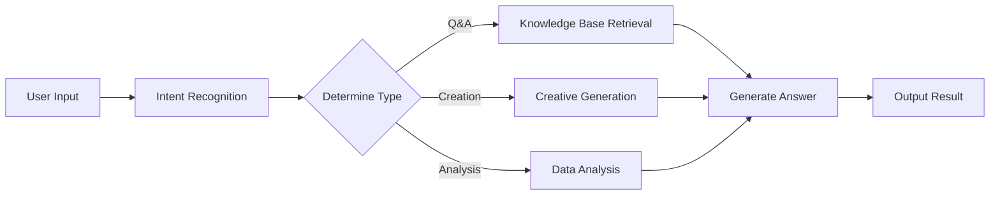
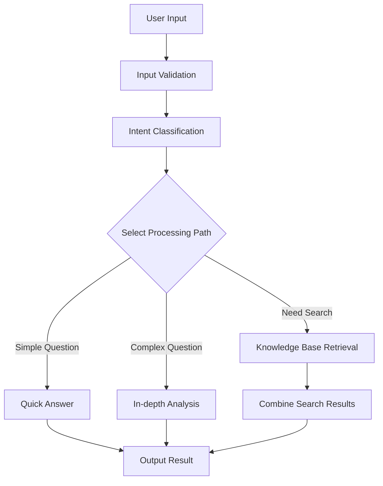

> ## Documentation Index
> Fetch the complete documentation index at: https://docs.apiyi.com/llms.txt
> Use this file to discover all available pages before exploring further.

# Dify

> Visual AIアプリケーション開発プラットフォームの統合ガイド

Difyは、AIアプリケーションを迅速に構築できるオープンソースのLLMアプリケーション開発プラットフォームです。APIYIを通じて、Difyでさまざまな主要AIモデルを利用できます。

## クイック連携

### 1. APIキーを取得

[APIYI コンソール](https://vip.apiyi.com)にアクセスして、APIキーを取得します。

### 2. モデルプロバイダーを設定

1. Difyプラットフォームにログインします
2. ユーザー名 > 設定をクリックします
3. 「モデルプロバイダー」を選択し、OpenAI API互換を選びます
4. モデルタイプに応じて設定方法を選択します


#### GPT、Claude、Geminiを含むすべてのモデルの設定

* モデルタイプ: LLMタイプを選択します（最初の列、画像は省略）

* モデル名: 任意ではなく、**標準モデル名**を入力する必要があります
  * 例: Gemini 2.5 Flash ではなく gemini-2.5-flash を入力します

* モデル表示名: 識別しやすいように、たとえば Gemini 2.5 Flash など自由に設定できます

* **APIキー**: [APIYIキー](https://api.apiyi.com/token)を入力します

* **APIエンドポイントURL**: `https://api.apiyi.com/v1`

* APIエンドポイント内のモデル名: gemini-2.5-flash のような標準名を使用します


モデル設定には、**実際の状況**に応じて更新すべきパラメータが多数あります:

注: Difyのモデル設定インターフェースは**最新ではありません**。たとえば、デフォルトのコンテキスト長4096はかなり小さいです。

各大規模モデルの具体的なコンテキスト長については、公式ドキュメント（このドキュメントセンターのリソースナビゲーションセクション）を参照してください


利用可能なパラメータがさらにあります


## コア機能

### Chat Assistant

インテリジェントなチャットアシスタントを作成します:

1. 「Chat Assistant」テンプレートを選択します
2. システムプロンプトを設定します:

```text theme={null}
You are a professional customer service assistant responsible for:
- Answering user questions
- Providing product information
- Handling after-sales service
Please maintain a friendly and professional attitude.
```

3. 適切なモデルを選択します（例: GPT-4）
4. パラメータを調整します:
   * Temperature: 0.7（創造性と正確性のバランスを取る）
   * 最大出力: 2000 tokens

### ワークフローアプリケーション

複雑なAIワークフローを構築します:



### ナレッジベースQ\&A

ドキュメントのナレッジベースを統合します:

1. ナレッジベースを作成します
2. ドキュメント（PDF、Word、Markdown）をアップロードします
3. 埋め込みモデルを選択します: `text-embedding-ada-002`
4. アプリケーション内でナレッジベースを参照します
5. 検索パラメータを設定します:
   * 検索件数: 3-5セグメント
   * 類似度しきい値: 0.7
   * 再ランキング: 有効

## アプリケーションの種類

### 1. チャットアシスタント

```yaml theme={null}
Application Type: Chat Assistant
Model: gpt-4
System Prompt: |
  You are a professional AI assistant with the following capabilities:
  - Answering various questions
  - Assisting in problem-solving
  - Providing advice and guidance

  Please always maintain a friendly, accurate, and helpful attitude.
Temperature: 0.7
Max Length: 2000
```

### 2. ドキュメント分析

```yaml theme={null}
Application Type: Workflow
Input: Document Upload
Processing Flow:
  1. Document Parsing
  2. Content Extraction
  3. Structured Analysis
  4. Generate Summary
Output: Analysis Report
```

### 3. コードアシスタント

```yaml theme={null}
Application Type: Chat Assistant
Model: gpt-4
System Prompt: |
  You are a professional programming assistant specializing in:
  - Code writing and optimization
  - Error debugging
  - Architecture design
  - Best practice recommendations

  Please provide clear and practical code solutions.
```

## 高度な機能

### API統合

DifyアプリケーションはAPI経由で呼び出せます:

```python theme={null}
import requests

url = "https://your-dify-instance/v1/chat-messages"
headers = {
    "Authorization": "Bearer YOUR_APP_API_KEY",
    "Content-Type": "application/json"
}

data = {
    "inputs": {},
    "query": "Hello, please introduce yourself",
    "response_mode": "streaming",
    "user": "user_123"
}

response = requests.post(url, headers=headers, json=data)
```

### バッチ処理

大量のデータを処理します:

1. CSVファイルを準備する
2. バッチタスクを作成する
3. 処理テンプレートを設定する
4. バッチタスクを実行する
5. 結果をエクスポートする

### マルチモーダルアプリケーション

テキストと画像の混在処理をサポートします:

```python theme={null}
# Multimodal input example
{
    "inputs": {
        "image": "data:image/jpeg;base64,...",
        "text": "Analyze the content in this image"
    },
    "query": "Please describe the image content in detail and provide analysis"
}
```

## モデル選定戦略

### シナリオ別選定

| 適用シナリオ    | 推奨モデル           | 理由        |
| --------- | --------------- | --------- |
| カスタマーサービス | GPT-3.5-Turbo   | 高速応答、低コスト |
| コンテンツ作成   | Claude 3 Sonnet | 高い創造性     |
| コードアシスタント | GPT-4           | 正確なロジック   |
| 文書分析      | Claude 3 Opus   | 長文理解に優れる  |
| データ分析     | GPT-4           | 高い推論能力    |

### コスト最適化

```yaml theme={null}
Development Environment:
  Model: gpt-3.5-turbo
  Max Length: 1000
  Temperature: 0.7

Production Environment:
  Model: gpt-4
  Max Length: 2000
  Temperature: 0.5
```

## ベストプラクティス

### 1. プロンプトの最適化

```text theme={null}
# Structured Prompt
## Role Definition
You are a professional [specific role]

## Task Description
Please help users with [specific task]

## Output Format
Please output in the following format:
1. Overview
2. Detailed Analysis
3. Recommendations

## Constraints
- Answers must be accurate
- Language should be clear
- Keep length within 500 words
```

### 2. ワークフロー設計



### 3. モニタリングと最適化

定期的なチェック:

* ユーザー満足度のフィードバック
* 応答時間の統計
* コストの使用状況
* エラー率の分析

### 4. バージョン管理

* アプリケーション設定を定期的にバックアップする
* リリース前に新しいバージョンをテストする
* ロールバック用に複数のバージョンを保持する

## トラブルシューティング

### よくある問題

#### モデル呼び出しの失敗

* API key の正確性を確認する
* アカウント残高が十分であることを確認する
* ネットワーク接続を確認する

#### レスポンス品質が低い

* prompt 設計を最適化する
* モデルのパラメータを調整する
* コンテキスト情報を追加する

#### パフォーマンスの問題

* より高速なモデルを選択する
* 出力長の上限を下げる
* キャッシュを有効にする

### パフォーマンス最適化

```yaml theme={null}
Cache Settings:
  Enabled: true
  Expiration: 3600 seconds
  Cache Condition: Same Input

Concurrency Control:
  Max Concurrency: 10
  Queue Size: 100
  Timeout: 30 seconds

Resource Limits:
  Memory Limit: 2GB
  CPU Limit: 80%
```

## デプロイメントの推奨事項

### 本番環境

```yaml theme={null}
# docker-compose.yml
version: '3.8'
services:
  dify-api:
    image: langgenius/dify-api:latest
    environment:
      - SECRET_KEY=your-secret-key
      - DB_HOST=postgres
      - REDIS_HOST=redis
      - OPENAI_API_KEY=your-apiyi-key
      - OPENAI_API_BASE=https://api.apiyi.com/v1
    depends_on:
      - postgres
      - redis

  dify-web:
    image: langgenius/dify-web:latest
    ports:
      - "3000:3000"
    depends_on:
      - dify-api

  postgres:
    image: postgres:14
    environment:
      - POSTGRES_DB=dify
      - POSTGRES_USER=dify
      - POSTGRES_PASSWORD=password

  redis:
    image: redis:alpine
```

### セキュリティ設定

* 機密情報の保存には環境変数を使用します
* HTTPSアクセスを有効にします
* アクセス制御を設定します
* 依存関係を定期的に更新します

### 監視の設定

```python theme={null}
# Monitoring script example
import requests
import time

def monitor_dify_health():
    try:
        response = requests.get("http://your-dify-instance/health")
        if response.status_code == 200:
            print("Dify running normally")
        else:
            print(f"Dify abnormal, status code: {response.status_code}")
    except Exception as e:
        print(f"Monitoring failed: {e}")

# Check every minute
while True:
    monitor_dify_health()
    time.sleep(60)
```

さらにサポートが必要ですか？[詳細な統合ドキュメント](/ja/scenarios/engineering/dify)をご確認ください。
