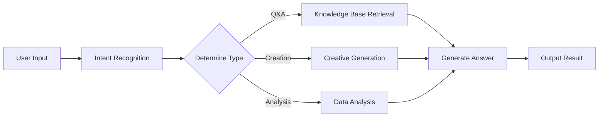
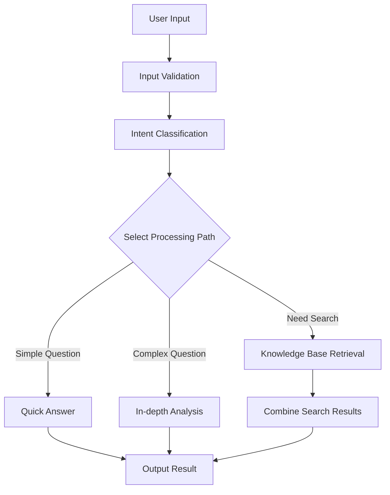

> ## Documentation Index
> Fetch the complete documentation index at: https://docs.apiyi.com/llms.txt
> Use this file to discover all available pages before exploring further.

# Dify

> 시각적 AI 애플리케이션 개발 플랫폼 통합 가이드

Dify는 AI 애플리케이션을 빠르게 구축할 수 있게 해주는 오픈 소스 LLM 애플리케이션 개발 플랫폼입니다. APIYI를 통해 Dify에서 다양한 주류 AI 모델을 사용할 수 있습니다.

## 빠른 연동

### 1. API Key 받기

[APIYI 콘솔](https://vip.apiyi.com)을 방문하여 API key를 받으십시오.

### 2. 모델 제공자 구성

1. Dify 플랫폼에 로그인합니다
2. 사용자명 > 설정을 클릭합니다
3. “Model Provider”를 선택하고 OpenAI-API 호환을 선택합니다
4. 모델 유형에 따라 구성 방법을 선택합니다


#### GPT, Claude, Gemini를 포함한 모든 모델에 대한 구성

* 모델 유형: LLM 유형을 선택합니다(첫 번째 열, 이미지는 생략됨)

* 모델 이름: 임의가 아니라 **표준 모델 이름**을 입력해야 합니다
  * 예시: Gemini 2.5 Flash 대신 gemini-2.5-flash를 입력합니다

* 모델 표시 이름: Gemini 2.5 Flash처럼 식별하기 쉽도록 무엇이든 입력할 수 있습니다

* **API Key**: [APIYI key](https://api.apiyi.com/token)를 입력합니다

* **API 엔드포인트 URL**: `https://api.apiyi.com/v1`

* API 엔드포인트의 모델 이름: gemini-2.5-flash처럼 표준 이름을 사용합니다


모델 구성에는 **실제 상황**에 따라 업데이트해야 할 매개변수가 많습니다:

참고: Dify의 모델 구성 인터페이스는 **최신 상태가 아닙니다**, 예를 들어 기본 컨텍스트 길이 4096은 상당히 짧습니다.

각 대형 모델의 구체적인 컨텍스트 길이는 공식 문서를 참조하십시오(이 문서 센터의 Resource Navigation 섹션)


추가로 사용할 수 있는 매개변수


## 핵심 기능

### 채팅 어시스턴트

지능형 채팅 어시스턴트를 생성합니다:

1. "Chat Assistant" 템플릿을 선택합니다
2. 시스템 prompt를 설정합니다:

```text theme={null}
You are a professional customer service assistant responsible for:
- Answering user questions
- Providing product information
- Handling after-sales service
Please maintain a friendly and professional attitude.
```

3. 적절한 모델을 선택합니다(예: GPT-4)
4. 파라미터를 조정합니다:
   * Temperature: 0.7(창의성과 정확성의 균형)
   * Max Output: 2000 tokens

### 워크플로 애플리케이션

복잡한 AI 워크플로를 구축합니다:



### 지식 베이스 Q\&A

문서 지식 베이스를 통합합니다:

1. 지식 베이스를 생성합니다
2. 문서를 업로드합니다(PDF, Word, Markdown)
3. 임베딩 모델을 선택합니다: `text-embedding-ada-002`
4. 애플리케이션에서 지식 베이스를 참조합니다
5. 검색 파라미터를 설정합니다:
   * 검색 개수: 3-5 세그먼트
   * 유사도 임계값: 0.7
   * Reranking: 활성화됨

## 애플리케이션 유형

### 1. 채팅 어시스턴트

```yaml theme={null}
Application Type: Chat Assistant
Model: gpt-4
System Prompt: |
  You are a professional AI assistant with the following capabilities:
  - Answering various questions
  - Assisting in problem-solving
  - Providing advice and guidance

  Please always maintain a friendly, accurate, and helpful attitude.
Temperature: 0.7
Max Length: 2000
```

### 2. 문서 분석

```yaml theme={null}
Application Type: Workflow
Input: Document Upload
Processing Flow:
  1. Document Parsing
  2. Content Extraction
  3. Structured Analysis
  4. Generate Summary
Output: Analysis Report
```

### 3. 코드 어시스턴트

```yaml theme={null}
Application Type: Chat Assistant
Model: gpt-4
System Prompt: |
  You are a professional programming assistant specializing in:
  - Code writing and optimization
  - Error debugging
  - Architecture design
  - Best practice recommendations

  Please provide clear and practical code solutions.
```

## 고급 기능

### API 통합

Dify 애플리케이션은 API를 통해 호출할 수 있습니다:

```python theme={null}
import requests

url = "https://your-dify-instance/v1/chat-messages"
headers = {
    "Authorization": "Bearer YOUR_APP_API_KEY",
    "Content-Type": "application/json"
}

data = {
    "inputs": {},
    "query": "Hello, please introduce yourself",
    "response_mode": "streaming",
    "user": "user_123"
}

response = requests.post(url, headers=headers, json=data)
```

### 일괄 처리

대량의 데이터를 처리합니다:

1. CSV 파일을 준비합니다
2. 일괄 작업을 생성합니다
3. 처리 템플릿을 구성합니다
4. 일괄 작업을 실행합니다
5. 결과를 내보냅니다

### 멀티모달 애플리케이션

텍스트와 이미지를 혼합하여 처리할 수 있습니다:

```python theme={null}
# Multimodal input example
{
    "inputs": {
        "image": "data:image/jpeg;base64,...",
        "text": "Analyze the content in this image"
    },
    "query": "Please describe the image content in detail and provide analysis"
}
```

## 모델 선택 전략

### 시나리오별 선택

| 적용 시나리오  | 권장 모델           | 이유           |
| -------- | --------------- | ------------ |
| 고객 서비스   | GPT-3.5-Turbo   | 빠른 응답, 낮은 비용 |
| 콘텐츠 제작   | Claude 3 Sonnet | 뛰어난 창의성      |
| 코드 어시스턴트 | GPT-4           | 정확한 논리       |
| 문서 분석    | Claude 3 Opus   | 긴 텍스트 이해에 강함 |
| 데이터 분석   | GPT-4           | 뛰어난 추론 능력    |

### 비용 최적화

```yaml theme={null}
Development Environment:
  Model: gpt-3.5-turbo
  Max Length: 1000
  Temperature: 0.7

Production Environment:
  Model: gpt-4
  Max Length: 2000
  Temperature: 0.5
```

## 모범 사례

### 1. Prompt 최적화

```text theme={null}
# Structured Prompt
## Role Definition
You are a professional [specific role]

## Task Description
Please help users with [specific task]

## Output Format
Please output in the following format:
1. Overview
2. Detailed Analysis
3. Recommendations

## Constraints
- Answers must be accurate
- Language should be clear
- Keep length within 500 words
```

### 2. 워크플로 설계



### 3. 모니터링 및 최적화

정기 점검:

* 사용자 만족도 피드백
* 응답 시간 통계
* 비용 사용량
* 오류율 분석

### 4. 버전 관리

* 애플리케이션 구성을 정기적으로 백업합니다
* 배포 전에 새 버전을 테스트합니다
* 롤백을 위해 여러 버전을 유지합니다

## 문제 해결

### 일반적인 문제

#### 모델 호출 실패

* API 키의 정확성을 확인합니다
* 충분한 계정 잔액을 확인합니다
* 네트워크 연결을 확인합니다

#### 응답 품질 저하

* prompt 설계를 최적화합니다
* 모델 매개변수를 조정합니다
* 컨텍스트 정보를 추가합니다

#### 성능 문제

* 더 빠른 모델을 선택합니다
* 출력 길이 제한을 줄입니다
* 캐싱을 활성화합니다

### 성능 최적화

```yaml theme={null}
Cache Settings:
  Enabled: true
  Expiration: 3600 seconds
  Cache Condition: Same Input

Concurrency Control:
  Max Concurrency: 10
  Queue Size: 100
  Timeout: 30 seconds

Resource Limits:
  Memory Limit: 2GB
  CPU Limit: 80%
```

## 배포 권장 사항

### 프로덕션 환경

```yaml theme={null}
# docker-compose.yml
version: '3.8'
services:
  dify-api:
    image: langgenius/dify-api:latest
    environment:
      - SECRET_KEY=your-secret-key
      - DB_HOST=postgres
      - REDIS_HOST=redis
      - OPENAI_API_KEY=your-apiyi-key
      - OPENAI_API_BASE=https://api.apiyi.com/v1
    depends_on:
      - postgres
      - redis

  dify-web:
    image: langgenius/dify-web:latest
    ports:
      - "3000:3000"
    depends_on:
      - dify-api

  postgres:
    image: postgres:14
    environment:
      - POSTGRES_DB=dify
      - POSTGRES_USER=dify
      - POSTGRES_PASSWORD=password

  redis:
    image: redis:alpine
```

### 보안 구성

* 민감한 정보는 환경 변수를 사용하여 저장합니다
* HTTPS 액세스를 활성화합니다
* 접근 제어를 설정합니다
* 종속성을 정기적으로 업데이트합니다

### 모니터링 설정

```python theme={null}
# Monitoring script example
import requests
import time

def monitor_dify_health():
    try:
        response = requests.get("http://your-dify-instance/health")
        if response.status_code == 200:
            print("Dify running normally")
        else:
            print(f"Dify abnormal, status code: {response.status_code}")
    except Exception as e:
        print(f"Monitoring failed: {e}")

# Check every minute
while True:
    monitor_dify_health()
    time.sleep(60)
```

더 도움이 필요하신가요? [상세 통합 문서](/ko/scenarios/engineering/dify)를 확인해 주십시오.
