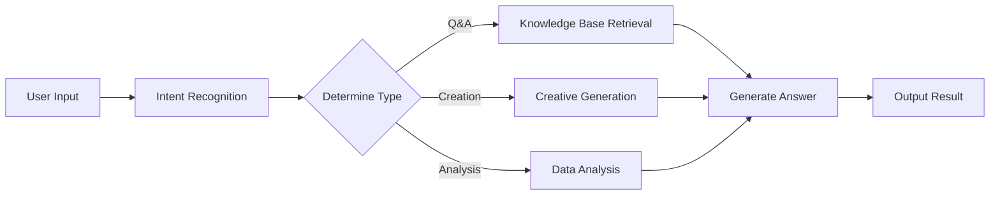
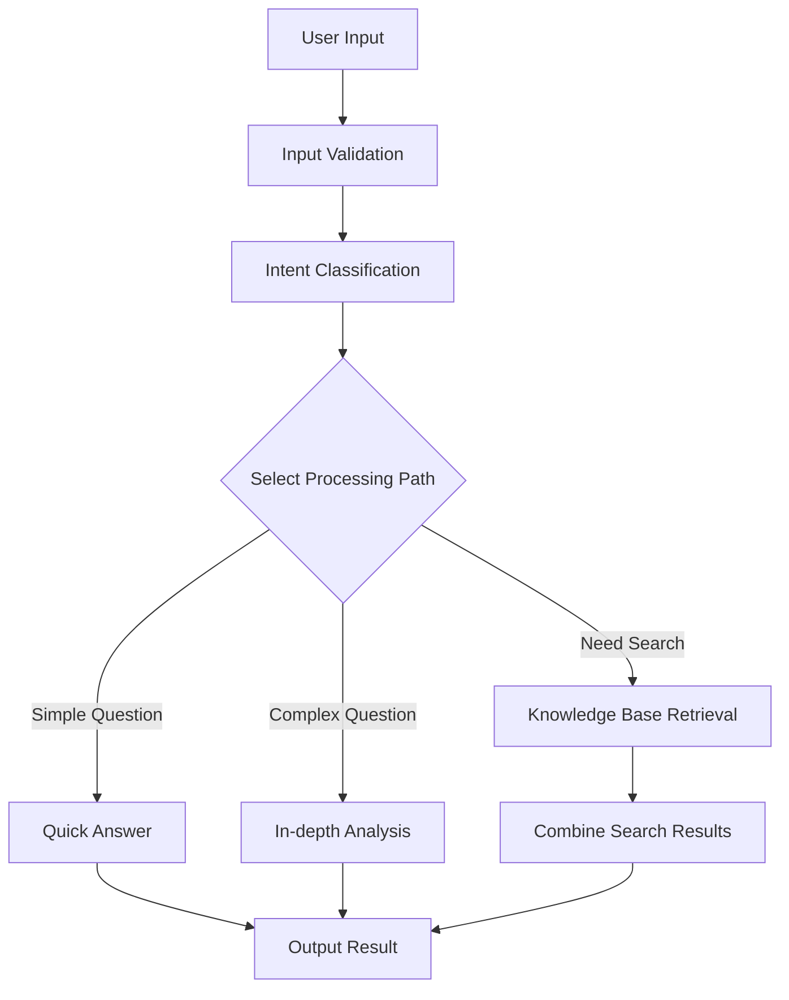

> ## Documentation Index
> Fetch the complete documentation index at: https://docs.apiyi.com/llms.txt
> Use this file to discover all available pages before exploring further.

# Dify

> Руководство по интеграции визуальной платформы разработки AI-приложений

Dify — это open-source платформа для разработки приложений на базе LLM, которая позволяет вам быстро создавать AI-приложения. Через APIYI вы можете использовать в Dify различные популярные AI-модели.

## Быстрая интеграция

### 1. Получите API Key

Перейдите в [консоль APIYI](https://vip.apiyi.com), чтобы получить свой ключ API.

### 2. Настройте провайдера модели

1. Войдите в платформу Dify
2. Нажмите на имя пользователя > Settings
3. Выберите "Model Provider" - укажите совместимый с OpenAI-API
4. Выберите способ настройки в зависимости от типа модели


#### Настройка для всех моделей, включая GPT, Claude, Gemini

* Тип модели: выберите тип LLM (первый столбец, изображение опущено)

* Имя модели: нужно указывать только **стандартное имя модели**, а не произвольное
  * Пример: введите gemini-2.5-flash вместо Gemini 2.5 Flash

* Отображаемое имя модели: может быть любым для удобной идентификации, например Gemini 2.5 Flash

* **API Key**: введите [ключ APIYI](https://api.apiyi.com/token)

* **URL эндпоинта API**: `https://api.apiyi.com/v1`

* Имя модели в эндпоинте API: используйте стандартное имя, например gemini-2.5-flash


В конфигурации модели есть много параметров, которые нужно обновлять в зависимости от **реальной ситуации**:

Примечание: интерфейс настройки модели в Dify **не актуален**, например, значение контекстного окна по умолчанию 4096 довольно мало.

Для точной длины контекстного окна каждой большой модели см. официальную документацию (раздел «Навигация по ресурсам» в этом центре документации)


Доступно больше параметров


## Основные возможности

### Чат-ассистент

Создавайте интеллектуальных чат-ассистентов:

1. Выберите шаблон «Чат-ассистент»
2. Настройте system prompt:

```text theme={null}
You are a professional customer service assistant responsible for:
- Answering user questions
- Providing product information
- Handling after-sales service
Please maintain a friendly and professional attitude.
```

3. Выберите подходящую модель (например, GPT-4)
4. Настройте параметры:
   * Temperature: 0.7 (балансируйте креативность и точность)
   * Max Output: 2000 tokens

### Приложение для workflow

Создавайте сложные AI workflow:



### Вопросы и ответы по базе знаний

Подключите базу знаний документов:

1. Создайте базу знаний
2. Загрузите документы (PDF, Word, Markdown)
3. Выберите embedding-модель: `text-embedding-ada-002`
4. Укажите базу знаний в приложении
5. Настройте параметры retrieval:
   * Количество retrieval: 3-5 сегментов
   * Порог similarity: 0.7
   * Reranking: Включено

## Типы приложений

### 1. Ассистент для чата

```yaml theme={null}
Application Type: Chat Assistant
Model: gpt-4
System Prompt: |
  You are a professional AI assistant with the following capabilities:
  - Answering various questions
  - Assisting in problem-solving
  - Providing advice and guidance

  Please always maintain a friendly, accurate, and helpful attitude.
Temperature: 0.7
Max Length: 2000
```

### 2. Анализ документов

```yaml theme={null}
Application Type: Workflow
Input: Document Upload
Processing Flow:
  1. Document Parsing
  2. Content Extraction
  3. Structured Analysis
  4. Generate Summary
Output: Analysis Report
```

### 3. Ассистент для кода

```yaml theme={null}
Application Type: Chat Assistant
Model: gpt-4
System Prompt: |
  You are a professional programming assistant specializing in:
  - Code writing and optimization
  - Error debugging
  - Architecture design
  - Best practice recommendations

  Please provide clear and practical code solutions.
```

## Расширенные возможности

### Интеграция с API

Приложения Dify можно вызывать через API:

```python theme={null}
import requests

url = "https://your-dify-instance/v1/chat-messages"
headers = {
    "Authorization": "Bearer YOUR_APP_API_KEY",
    "Content-Type": "application/json"
}

data = {
    "inputs": {},
    "query": "Hello, please introduce yourself",
    "response_mode": "streaming",
    "user": "user_123"
}

response = requests.post(url, headers=headers, json=data)
```

### Пакетная обработка

Обрабатывайте большие объемы данных:

1. Подготовьте CSV-файл
2. Создайте пакетную задачу
3. Настройте шаблон обработки
4. Выполните пакетную задачу
5. Экспортируйте результаты

### Мультимодальное приложение

Поддерживает обработку текста и изображений в смешанном режиме:

```python theme={null}
# Multimodal input example
{
    "inputs": {
        "image": "data:image/jpeg;base64,...",
        "text": "Analyze the content in this image"
    },
    "query": "Please describe the image content in detail and provide analysis"
}
```

## Стратегия выбора модели

### Выбор по сценарию

| Сценарий применения   | Рекомендуемая модель | Причина                           |
| --------------------- | -------------------- | --------------------------------- |
| Обслуживание клиентов | GPT-3.5-Turbo        | Быстрый ответ, низкая стоимость   |
| Создание контента     | Claude 3 Sonnet      | Высокая креативность              |
| Ассистент для кода    | GPT-4                | Точная логика                     |
| Анализ документов     | Claude 3 Opus        | Хорошее понимание длинных текстов |
| Анализ данных         | GPT-4                | Сильная способность к рассуждению |

### Оптимизация затрат

```yaml theme={null}
Development Environment:
  Model: gpt-3.5-turbo
  Max Length: 1000
  Temperature: 0.7

Production Environment:
  Model: gpt-4
  Max Length: 2000
  Temperature: 0.5
```

## Лучшие практики

### 1. Оптимизация prompt

```text theme={null}
# Structured Prompt
## Role Definition
You are a professional [specific role]

## Task Description
Please help users with [specific task]

## Output Format
Please output in the following format:
1. Overview
2. Detailed Analysis
3. Recommendations

## Constraints
- Answers must be accurate
- Language should be clear
- Keep length within 500 words
```

### 2. Проектирование workflow



### 3. Мониторинг и оптимизация

Регулярные проверки:

* Обратная связь по удовлетворенности пользователей
* Статистика времени ответа
* Использование затрат
* Анализ частоты ошибок

### 4. Управление версиями

* Регулярно создавайте резервные копии конфигурации приложения
* Тестируйте новые версии перед выпуском
* Храните несколько версий для отката

## Устранение неполадок

### Распространенные проблемы

#### Сбой вызова модели

* Проверьте правильность ключа API
* Убедитесь, что на счете достаточно баланса
* Проверьте сетевое подключение

#### Низкое качество ответа

* Оптимизируйте структуру prompt
* Настройте параметры модели
* Добавьте информацию о контексте

#### Проблемы с производительностью

* Выберите более быстрые модели
* Уменьшите лимиты длины вывода
* Включите кэширование

### Оптимизация производительности

```yaml theme={null}
Cache Settings:
  Enabled: true
  Expiration: 3600 seconds
  Cache Condition: Same Input

Concurrency Control:
  Max Concurrency: 10
  Queue Size: 100
  Timeout: 30 seconds

Resource Limits:
  Memory Limit: 2GB
  CPU Limit: 80%
```

## Рекомендации по развертыванию

### Производственная среда

```yaml theme={null}
# docker-compose.yml
version: '3.8'
services:
  dify-api:
    image: langgenius/dify-api:latest
    environment:
      - SECRET_KEY=your-secret-key
      - DB_HOST=postgres
      - REDIS_HOST=redis
      - OPENAI_API_KEY=your-apiyi-key
      - OPENAI_API_BASE=https://api.apiyi.com/v1
    depends_on:
      - postgres
      - redis

  dify-web:
    image: langgenius/dify-web:latest
    ports:
      - "3000:3000"
    depends_on:
      - dify-api

  postgres:
    image: postgres:14
    environment:
      - POSTGRES_DB=dify
      - POSTGRES_USER=dify
      - POSTGRES_PASSWORD=password

  redis:
    image: redis:alpine
```

### Настройка безопасности

* Используйте переменные среды для хранения конфиденциальной информации
* Включите доступ по HTTPS
* Настройте контроль доступа
* Регулярно обновляйте зависимости

### Настройка мониторинга

```python theme={null}
# Monitoring script example
import requests
import time

def monitor_dify_health():
    try:
        response = requests.get("http://your-dify-instance/health")
        if response.status_code == 200:
            print("Dify running normally")
        else:
            print(f"Dify abnormal, status code: {response.status_code}")
    except Exception as e:
        print(f"Monitoring failed: {e}")

# Check every minute
while True:
    monitor_dify_health()
    time.sleep(60)
```

Нужна дополнительная помощь? Пожалуйста, ознакомьтесь с [Подробной документацией по интеграции](/ru/scenarios/engineering/dify).
