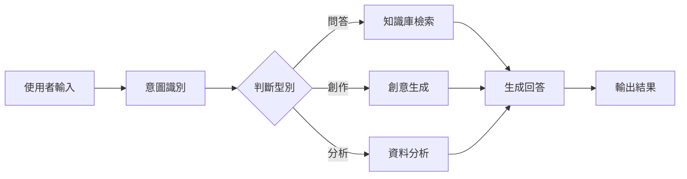
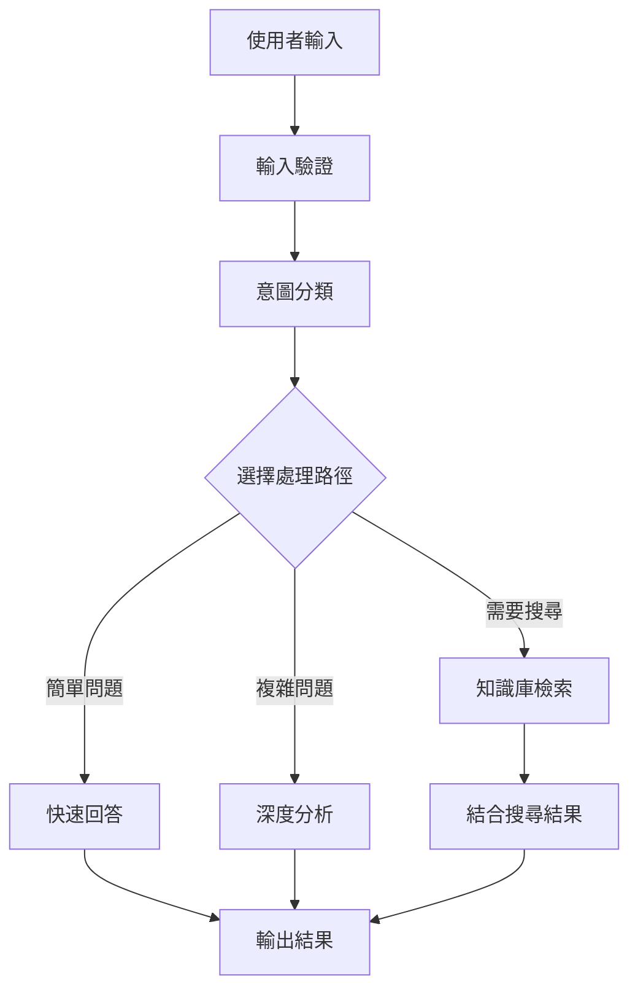

> ## Documentation Index
> Fetch the complete documentation index at: https://docs.apiyi.com/llms.txt
> Use this file to discover all available pages before exploring further.

# Dify

> 視覺化 AI 應用開發平臺整合指南

# Dify

Dify 是一個開源的 LLM 應用開發平臺，讓您能夠快速搭建 AI 應用。通過 API易，您可以在 Dify 中使用各種主流 AI 模型。

## 快速整合

### 1. 獲取 API 金鑰

訪問 [API易控制台](https://vip.apiyi.com) 獲取您的 API 金鑰。

### 2. 配置模型供應商

1. 登入 Dify 平臺
2. 點選使用者名稱 > 設定
3. 選擇"模型供應商" - 選擇 OpenAI-API-compatible
4. 根據模型型別選擇配置方式


#### 所有模型，包括 GPT、Claude、Gemini 模型配置

* 模型型別：選擇 LLM 型別（第一個欄目，圖略）

* 模型名稱：需要輸入**模型規範名稱**，不能亂輸入
  * 舉例：輸入 gemini-2.5-flash  而不能輸入 Gemini 2.5 Flash。

* 模型顯示名稱：可以隨意，方便辨識即可，比如可以寫 Gemini 2.5 Flash

* **API Key**：輸入 [API易 金鑰](https://api.apiyi.com/token)

* **API endpoint URL**：`https://api.apiyi.com/v1`

* API endpoint中的模型名稱，寫規範名稱：gemini-2.5-flash


模型配置裡有很多引數按**實際情況**更新：

注：Dify 的模型配置介面並沒有**與時俱進**，比如大模型的上下文長度的預設值寫的 4096 是比較小的數值。

每個大模型的具體上下文長度，可以參考各大官方文件（本文件中心-資源導航欄目）


還有更多引數


## 核心功能

### 對話助手

建立智慧對話助手：

1. 選擇"對話助手"模板
2. 配置系統提示詞：

```text theme={null}
你是一個專業的客服助手，負責：
- 回答使用者問題
- 提供產品資訊
- 處理售後服務
請保持友好和專業的態度。
```

3. 選擇合適的模型（如 GPT-4）
4. 調整引數：
   * 溫度：0.7（平衡創造性和準確性）
   * 最大輸出：2000 tokens

### 工作流應用

構建複雜的 AI 工作流：



### 知識庫問答

整合文件知識庫：

1. 建立知識庫
2. 上傳文件（PDF、Word、Markdown）
3. 選擇嵌入模型：`text-embedding-ada-002`
4. 在應用中引用知識庫
5. 配置檢索引數：
   * 檢索數量：3-5 個片段
   * 相似度閾值：0.7
   * 重排序：開啟

## 應用型別

### 1. 聊天助手

```yaml theme={null}
應用型別: 對話助手
模型: gpt-4
系統提示: |
  你是一個專業的AI助手，具備以下能力：
  - 回答各種問題
  - 協助解決問題
  - 提供建議和指導
  
  請始終保持友好、準確、有幫助的態度。
溫度: 0.7
最大長度: 2000
```

### 2. 文件分析

```yaml theme={null}
應用型別: 工作流
輸入: 上傳文件
處理流程:
  1. 文件解析
  2. 內容提取
  3. 結構化分析
  4. 生成摘要
輸出: 分析報告
```

### 3. 程式碼助手

```yaml theme={null}
應用型別: 對話助手  
模型: gpt-4
系統提示: |
  你是一個專業的程式設計助手，專長：
  - 程式碼編寫和最佳化
  - 錯誤除錯
  - 架構設計
  - 最佳實踐建議
  
  請提供清晰、實用的程式碼解決方案。
```

## 高階功能

### API 整合

Dify 應用可以通過 API 呼叫：

```python theme={null}
import requests

url = "https://your-dify-instance/v1/chat-messages"
headers = {
    "Authorization": "Bearer YOUR_APP_API_KEY",
    "Content-Type": "application/json"
}

data = {
    "inputs": {},
    "query": "你好，請介紹一下你自己",
    "response_mode": "streaming",
    "user": "user_123"
}

response = requests.post(url, headers=headers, json=data)
```

### 批次處理

處理大量資料：

1. 準備 CSV 檔案
2. 建立批處理任務
3. 配置處理模板
4. 執行批次任務
5. 匯出結果

### 多模態應用

支援文本和影像的混合處理：

```python theme={null}
# 多模態輸入示例
{
    "inputs": {
        "image": "data:image/jpeg;base64,...",
        "text": "分析這張圖片中的內容"
    },
    "query": "請詳細描述圖片內容並提供分析"
}
```

## 模型選擇策略

### 按場景選擇

<Card title="檢視場景化模型推薦" icon="star" href="/zh-Hant/api-capabilities/model-info">
  檢視最新的場景化模型推薦，包括文本創作、程式設計開發、快速響應、長文本處理等全場景的最佳模型選擇。
</Card>

<Info>
  **為什麼不在此列出具體模型？**

  AI 模型更新迭代速度非常快，為了確保您獲取最準確的模型推薦資訊，我們統一在 [模型推薦頁面](/zh-Hant/api-capabilities/model-info) 維護最新的模型列表、效能資料和使用建議。
</Info>

### 成本最佳化

```yaml theme={null}
開發環境:
  模型: gpt-3.5-turbo
  最大長度: 1000
  溫度: 0.7

生產環境:
  模型: gpt-4
  最大長度: 2000
  溫度: 0.5
```

## 最佳實踐

### 1. 提示詞最佳化

```text theme={null}
# 結構化提示詞
## 角色定義
你是一個專業的[具體角色]

## 任務說明
請幫助使用者[具體任務]

## 輸出格式
請按以下格式輸出：
1. 概述
2. 詳細分析
3. 建議

## 約束條件
- 回答要準確
- 語言要通俗
- 長度控制在500字內
```

### 2. 工作流設計



### 3. 監控和最佳化

定期檢查：

* 使用者滿意度反饋
* 響應時間統計
* 成本使用情況
* 錯誤率分析

### 4. 版本管理

* 定期備份應用配置
* 測試新版本後再發布
* 保留多個版本以便回滾

## 故障排除

### 常見問題

#### 模型呼叫失敗

* 檢查 API 金鑰正確性
* 確認賬戶餘額充足
* 驗證網路連線

#### 響應品質差

* 最佳化提示詞設計
* 調整模型引數
* 增加上下文資訊

#### 效能問題

* 選擇更快的模型
* 減少輸出長度限制
* 啟用快取功能

### 效能最佳化

```yaml theme={null}
快取設定:
  啟用: true
  過期時間: 3600秒
  快取條件: 相同輸入

併發控制:
  最大併發: 10
  佇列大小: 100
  超時時間: 30秒

資源限制:
  記憶體限制: 2GB
  CPU限制: 80%
```

## 部署建議

### 生產環境

```yaml theme={null}
# docker-compose.yml
version: '3.8'
services:
  dify-api:
    image: langgenius/dify-api:latest
    environment:
      - SECRET_KEY=your-secret-key
      - DB_HOST=postgres
      - REDIS_HOST=redis
      - OPENAI_API_KEY=your-apiyi-key
      - OPENAI_API_BASE=https://api.apiyi.com/v1
    depends_on:
      - postgres
      - redis
  
  dify-web:
    image: langgenius/dify-web:latest
    ports:
      - "3000:3000"
    depends_on:
      - dify-api
  
  postgres:
    image: postgres:14
    environment:
      - POSTGRES_DB=dify
      - POSTGRES_USER=dify
      - POSTGRES_PASSWORD=password
  
  redis:
    image: redis:alpine
```

### 安全配置

* 使用環境變數儲存敏感資訊
* 啟用 HTTPS 訪問
* 設定訪問權限控制
* 定期更新依賴包

### 監控設定

```python theme={null}
# 監控指令碼示例
import requests
import time

def monitor_dify_health():
    try:
        response = requests.get("http://your-dify-instance/health")
        if response.status_code == 200:
            print("Dify 執行正常")
        else:
            print(f"Dify 異常，狀態碼: {response.status_code}")
    except Exception as e:
        print(f"監控失敗: {e}")

# 每分鐘檢查一次
while True:
    monitor_dify_health()
    time.sleep(60)
```

需要更多幫助？請檢視 [詳細整合文件](/zh-Hant/scenarios/engineering/dify)。
