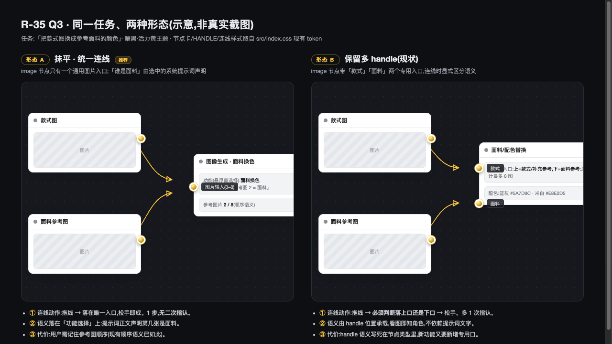

# R-35 Q3 · 画布形态对比材料(供拍板)

- 日期:2026-09-18 · 作者:designer
- 范围:只出对比材料,不实现、不改 `src/**`、不改 design 契约文件
- 关联:`../plan.md` §1.3 / §6 Q3

## 0. 问题复述

新三节点模型下,`fabric-recolor` 时代的「面料专用 handle」(`targetHandle="fabric"`)是抹平还是保留:

- 形态 A(抹平,推荐):image 节点只有一个通用图片入口(0–8 条入边,顺序语义);「谁是面料」由选中的系统提示词在正文里声明。
- 形态 B(保留):image 节点左侧保留「款式/面料」两个专用入口(现状,`FabricRecolorNode.tsx` 两个 `<Handle type="target" id="garment|fabric">`)。

## 1. 产物清单与真实性标注

| 文件 | 类型 | 真实性 |
|---|---|---|
| `shots/forms-comparison-schematic.png` | 对比主图 | **示意**(HTML 原型截图;节点/handle/连线样式 1:1 取自 `src/index.css` 现有 token:18px 径向渐变圆珠 handle、`--gc-edge` 单色线+箭头 marker、白卡+软阴影) |
| `prototype-forms.html` | 对比主图源文件 | 示意;浏览器打开可复截 |
| `shots/real-canvas-2026-09-17.png` | 现状画布参考 | **真实截图**(2026-09-17 UI 审计存档;当时为暗金主题,现已换活力黄,仅作结构参考) |

**未能截到实时真实画布**:本地 dev(5173)在线,但登录密码仅存于 vault 的 5174 origin,headless 会话无法弹保存框;5174 无服务,origin 严格绑定故不可复用。形态 B 的节点结构以 `src/components/nodes/FabricRecolorNode.tsx:83-96`(双 target handle,32%/68% 位)为据,样式以 token 为据,示意精度足够支撑拍板。

## 2. 对比主图

同一场景(款式图 + 面料参考图 → 面料换色),左右对照。差异点标注:

| 维度 | 形态 A(抹平) | 形态 B(保留多 handle) |
|---|---|---|
| **连线动作** | 拖线 → 落在唯一入口,松手即成。**1 步,无二次指认** | 拖线 → 须判断落上口(款式)还是下口(面料) → 松手。**多 1 次指认** |
| **画布拥挤度** | 每节点 1 个入口 handle;两条线汇聚一点 | 每节点 2 个入口 handle + 2 个角色标签;入口区视觉密度翻倍 |
| **语义清晰度(看图)** | 入口无角色;角色藏在节点内「功能:面料换色 + 提示词声明参考图 2 = 面料」 | 入口自带角色标签,看图即知哪条线是面料 |
| **语义承载位置** | 提示词目录(内容层,可改文案不改结构) | 节点类型结构(代码层,加新功能 = 加新 handle) |

## 3. 决定性因素:连错线时会发生什么

**形态 A(抹平)**:没有「错口」可言——所有图片入边进同一池,顺序即语义。风险转移为「顺序错」:用户把面料连成参考图 1、款式连成参考图 2,提示词声明与实际顺序不符,**结果跑偏但不报错**;靠运行前预览(参考图列表按顺序展示缩略图)兜底,该列表 UI 已存在。

**形态 B(保留)**:「错口」在连线瞬间即被结构拦截或显式可见(面料线挂到款式口,一眼能看出来),运行前置检查还能 fail-closed 拒绝(现有 `assertPlanInputs` 的 fabric 检查)。**错误更早暴露、更便宜**;但代价是这条防线写死在节点结构里,与「功能从结构退化为内容」的重构主线(R1)直接冲突——每新增一个带角色输入的功能,就要回到代码层加 handle。

## 4. 设计师推荐与理由

**推荐形态 A(抹平)**,与 `plan.md` §1.3 的推荐一致。三条理由:

1. **连线模型统一是本次重构的核心收益**。9 种节点退役的本质就是「结构特化 → 内容表达」;唯独给 image 节点留一对 fabric/garment 专用口,等于在统一模型上保留一个特例伤疤,后续每个带角色的新功能都会来挑战这个先例。
2. **B 的语义优势可以被 A 的既有 UI 回收**。顺序语义 + 参考图缩略图列表(按序展示、可溯源 `sourceNodeId`)已经存在;在悬浮窗/节点内的参考图列表上加「第 N 张 = 面料」的提示词声明回显,看图即可恢复大部分语义可见性,不需要结构上的第二入口。
3. **连错线的风险等级不对称**。B 防的是「连线瞬间错」;A 的风险是「顺序错、静默跑偏」。但顺序错在参考图列表里可视、可改(换顺序比重连线便宜),且服装场景参考图通常 ≤3 张,顺序记忆负担小。用一次运行内可见的顺序确认,换连线模型的永久统一,划算。

若用户仍认为 fabric/garment 区分有保留价值(如面料换色是高频核心玩法、连错代价实测很高),选 B 也不阻塞重构——但需接受 image 节点 handle 集合随功能变体变化的长期复杂度。

## 5. 附:现状结构证据(代码引用)

- 双 handle:`src/components/nodes/FabricRecolorNode.tsx:83-96`(`id="garment"` top 32%、`id="fabric"` top 68%)
- 连线校验特例:`selectActiveEdges(...).some(e => e.targetHandle === "fabric")`(同文件 :29-31)
- 样式 token:handle 18px 径向渐变圆珠、连线 `--gc-edge` 单色 + 箭头 marker(`src/index.css:111-156,534-557`、`src/components/edges/PulseEdge.tsx`)
